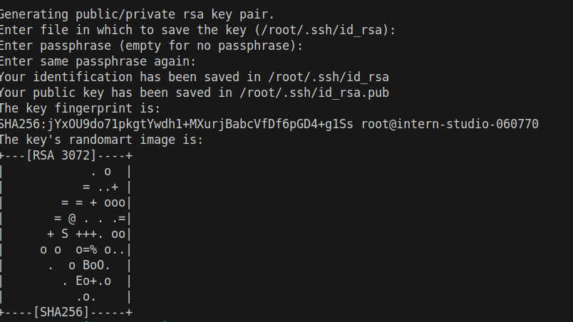
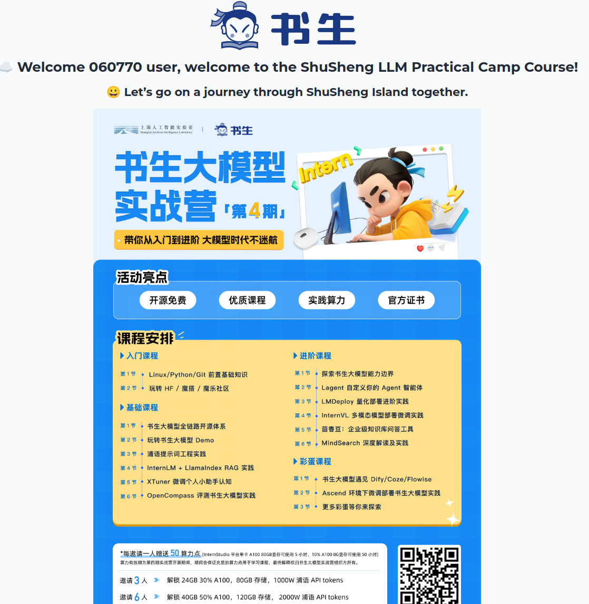
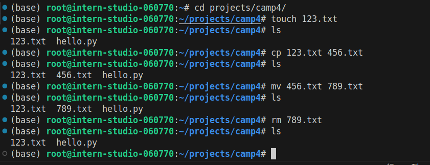
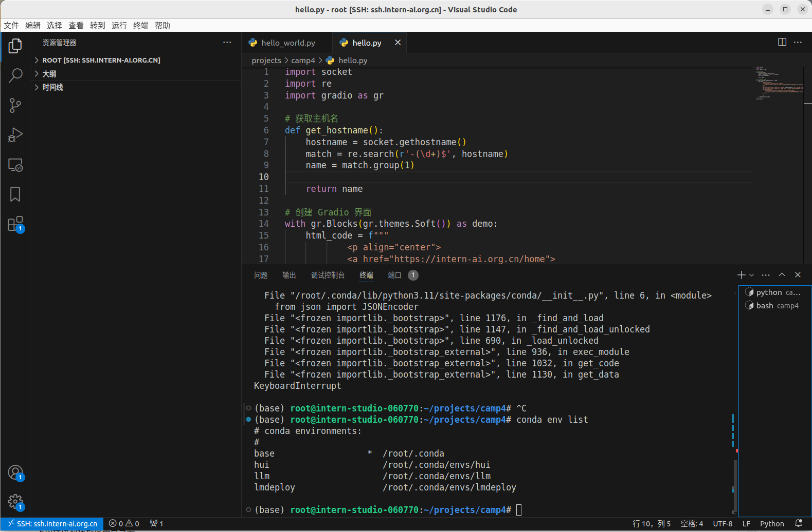

# 1.进行SSH连接与端口映射并运行hello_world.py
## 1.1生成密钥与端口映射
使用命令生成密钥`ssh-keygen -t rsa`

拷贝密钥后用`ssh -CNg -L 7860:127.0.0.1:7860 root@ssh.intern-ai.org.cn -p XXX`命令可以将本地7860与远程7860端口进行映射
## 1.2远程运行hello.py生成海报图片
在客户端输入`python hello.py`打开浏览器输入`http://127.0.0.1:7860/`可以看见生成的海报

# o1.Linux基础命令
一些基础linux命令运行如下图

# 02.vscode 创建conda环境
开发机中输入`conda create -n llm`生成llm虚拟环境
