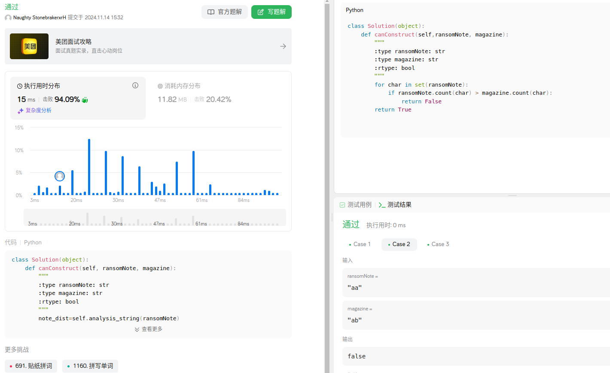
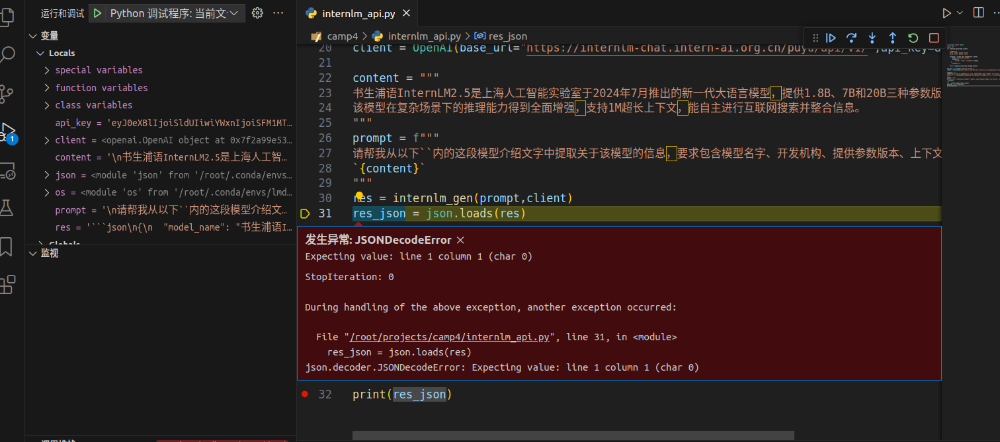
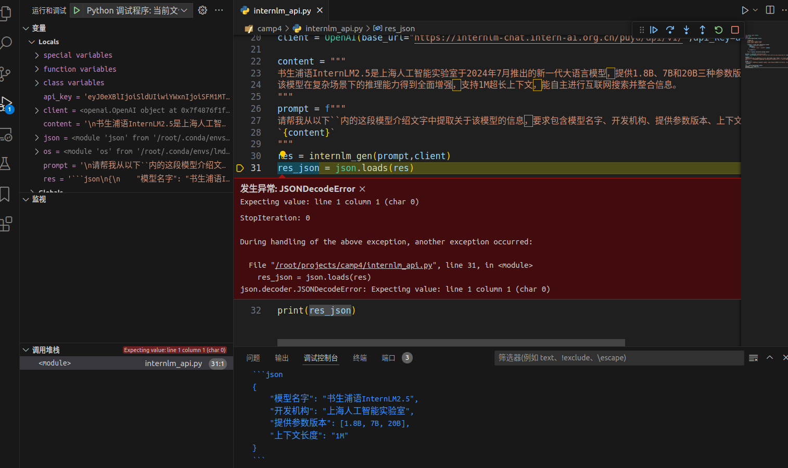
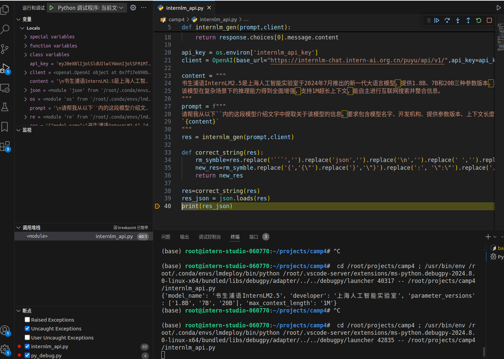
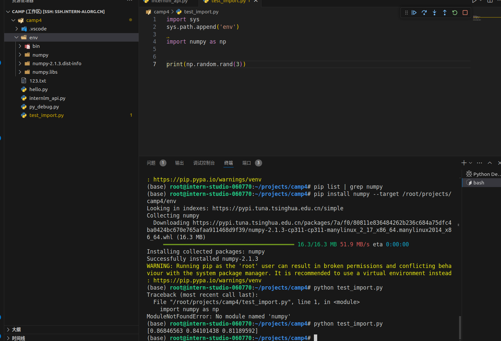

# 1.leetcode提交
``` python
class Solution(object):
    def canConstruct(self, ransomNote, magazine):
        """
        :type ransomNote: str
        :type magazine: str
        :rtype: bool
        """
        for char in set(ransomNote):
            if ransomNote.count(char) > magazine.count(char):
                return False
        return True
```


# 2.调试接口调用
1. 直接调试发现有bug

2. 设置断点打印出res的值

3. 分析发现有两个问题：1.头尾有多余字符；2.部分值缺少引号。用python替换

4. 代码
``` python
from openai import OpenAI
import json
import os
import re
def internlm_gen(prompt,client):
    '''
    LLM生成函数
    Param prompt: prompt string
    Param client: OpenAI client 
    '''
    response = client.chat.completions.create(
        model="internlm2.5-latest",
        messages=[
            {"role": "user", "content": prompt},
      ],
        stream=False
    )
    return response.choices[0].message.content

api_key = os.environ['internlm_api_key']
client = OpenAI(base_url="https://internlm-chat.intern-ai.org.cn/puyu/api/v1/",api_key=api_key)

content = """
书生浦语InternLM2.5是上海人工智能实验室于2024年7月推出的新一代大语言模型，提供1.8B、7B和20B三种参数版本，以适应不同需求。
该模型在复杂场景下的推理能力得到全面增强，支持1M超长上下文，能自主进行互联网搜索并整合信息。
"""
prompt = f"""
请帮我从以下``内的这段模型介绍文字中提取关于该模型的信息，要求包含模型名字、开发机构、提供参数版本、上下文长度四个内容，以json格式返回。
`{content}`
"""
res = internlm_gen(prompt,client)

def correct_string(res):
    rm_symble=res.replace('```','').replace('json','').replace('\n','').replace(' ','').replace("\"","")
    new_res=rm_symble.replace('{','{\"').replace('}','\"}').replace(':', '\":\"').replace(',','\",\"').replace('\"[','[\"').replace(']\"','\"]')
    return new_res

res=correct_string(res)
res_json = json.loads(res)
print(res_json)
```

# 3.外部调用python包
1. 卸载numpy`pip uninstall numpy`
2. 将numpy安装在env文件夹下`pip install numpy --target env`
3. 用python调用

``` python
import sys
sys.path.append('env')

import numpy as np


print(np.random.rand(3))
```
