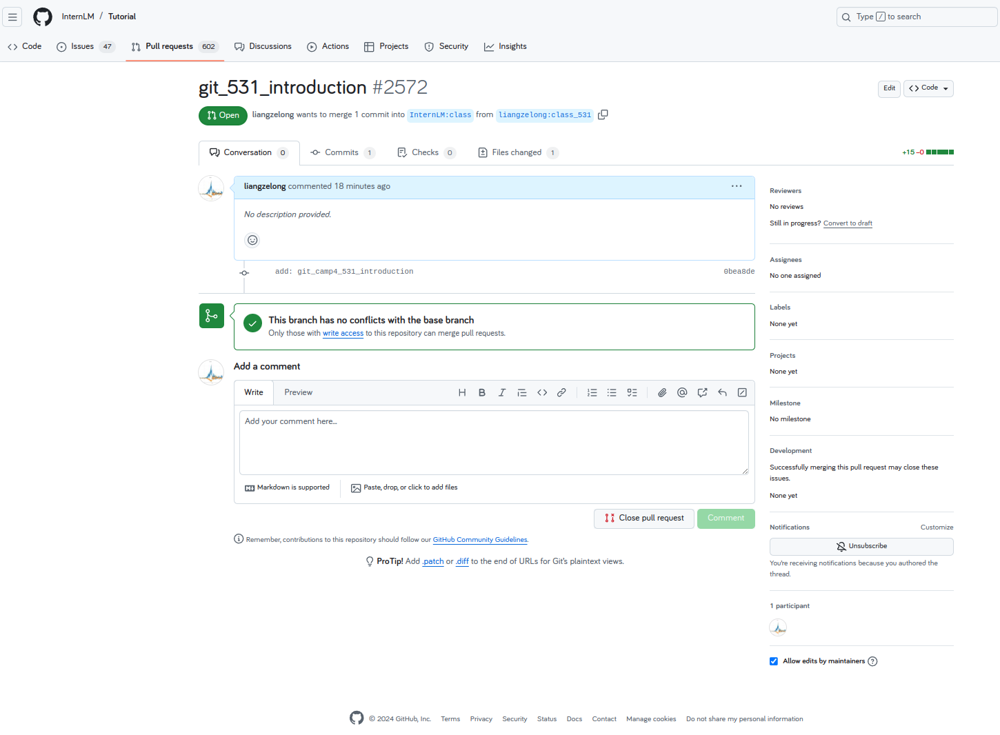

# 1.git 与 github的关系
Git 是一种分布式版本控制系统，用于跟踪代码的更改和协作开发。它由林纳斯·托瓦兹（Linus Torvalds）在 2005 年开发，旨在高效地管理大型项目的代码版本。

GitHub 是一个基于 Git 的在线代码托管和协作平台。它提供了一个使用 Git 的中央仓库，方便开发者在互联网上共享代码、协作开发。除了基本的代码托管功能，GitHub 还提供了丰富的协作工具，例如问题跟踪（Issues）、代码评审（Pull Requests）、项目管理板（Projects）等。

二者的关系：

工具与平台：Git 是一个版本控制工具，而 GitHub 是基于 Git 的平台。GitHub 使用 Git 作为底层技术，为其提供版本控制功能。

独立性：你可以在本地使用 Git 而不需要 GitHub，但使用 GitHub 通常需要了解 Git 的基本操作。

协作功能：GitHub 扩展了 Git 的功能，提供了社交编码的环境，方便开发者之间的协作。

总结：Git 是用于版本控制的工具，GitHub 则是基于 Git 的代码托管和协作平台。GitHub 利用了 Git 的强大功能，并在其上添加了许多协作和管理的特性，促进了开源和商业项目的开发。

# 2.git使用与流程
## 2.1用户配置
首先将本地git配置，输入用户名与邮箱
```
git config --global user.name "Your Name"
git config --global user.email "your.email@example.com"
git config --global --list
```
## 2.2远程fork仓库


## 2.3本地克隆与切换分支
```
# 克隆
git clone git@github.com:liangzelong/Tutorial.git
# 切换分支
cd Tutorial
git checkout -b class_531
```
## 2.4编辑与推送
在本地编辑文件

编辑后用命令推送
```
git add .
git commit -m "git_531_introduction"
git push
```

## 2.5github上进行pr
