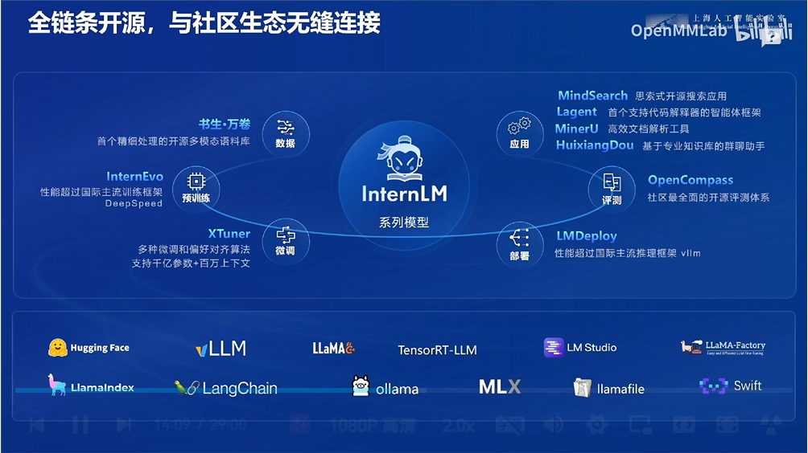
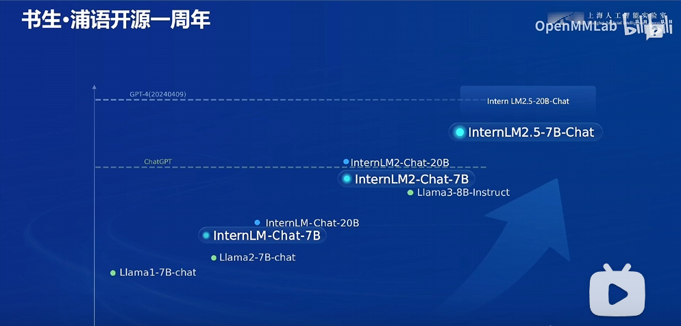
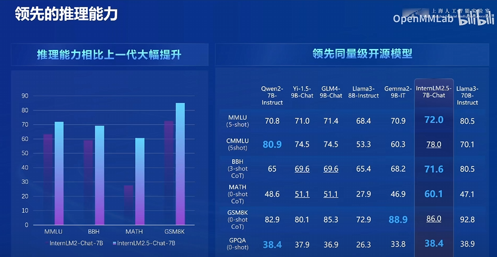
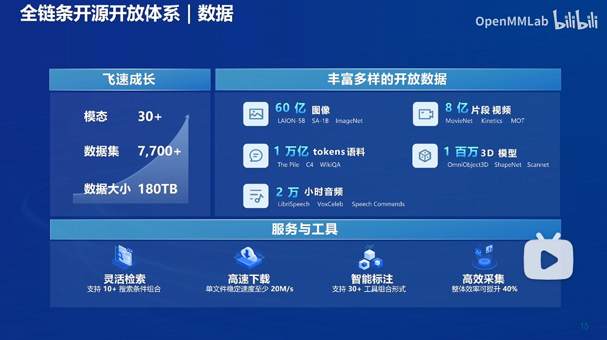
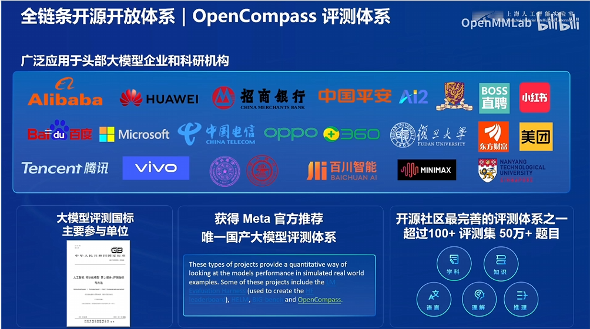

# 书生大模型全链路开源体系

## 1.书生大模型体系

书生开源大模型体系包含了数据、训练、微调、部署以及应用等诸多模块，可以完成整个大模型的全流程生态。

## 2.性能对比

开源模型目前已超过了ChatGPT水平，并且接近GPT4水平。

## 3.开源数据集集合

目前已经拥有数据图像60亿、8亿段视频以及1万亿语料

## 4.评测体系
目前已经建成了OpenCompass评测体系，是Meta认证的中国评测体系

