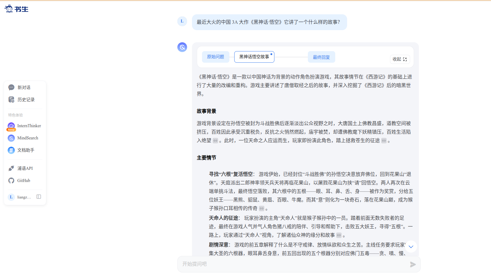
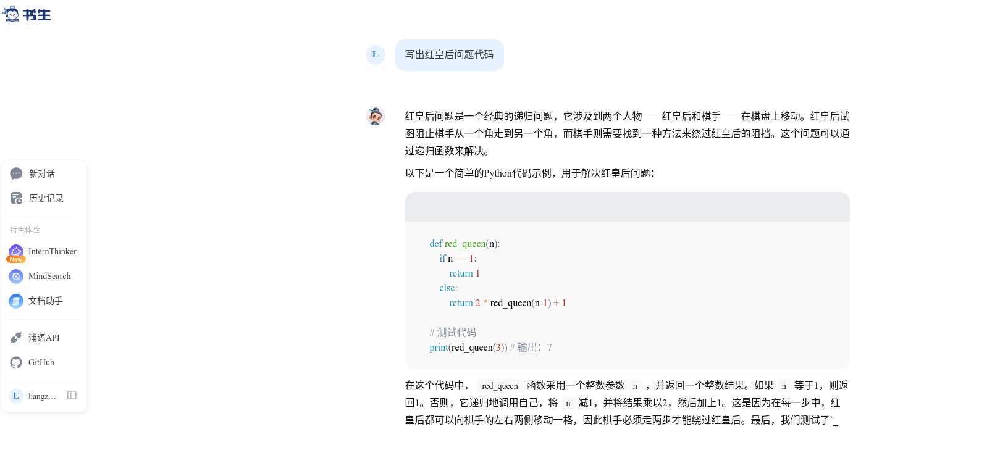
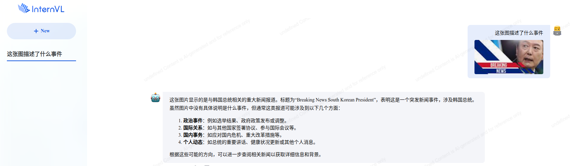

# 玩转书生「多模态对话」与「AI搜索」
# 1.MindSearch
MindSearch是InternLM 组织今年开源的 AI 搜索引擎 (框架)，基于多智能体技术将你提出的问题进行分析、拆解、网页搜索，最终给出有参考依据的高可信度回答。目前可直接在书生·浦语产品内体验以 InternLM2.5-20B 为 Agent 的 MindSearch 官方实现。

以“最近大火的中国 3A 大作《黑神话·悟空》它讲了一个什么样的故事？”为例效果如下图所示：

其优点是将思维连可视化出来

# 2.书生·浦语
书生·浦语是InternLM 开源模型官方的对话类产品，可以进行代码编程、文章创作、灵感创意、角色扮演、语言翻译等工作。

以“最写出红皇后问题代码”为例效果如下图所示：

# 3.书生·万象
InternVL 开源的视觉语言模型官方的对话产品

以“最这张图描述了什么事件”为例效果如下图所示：
