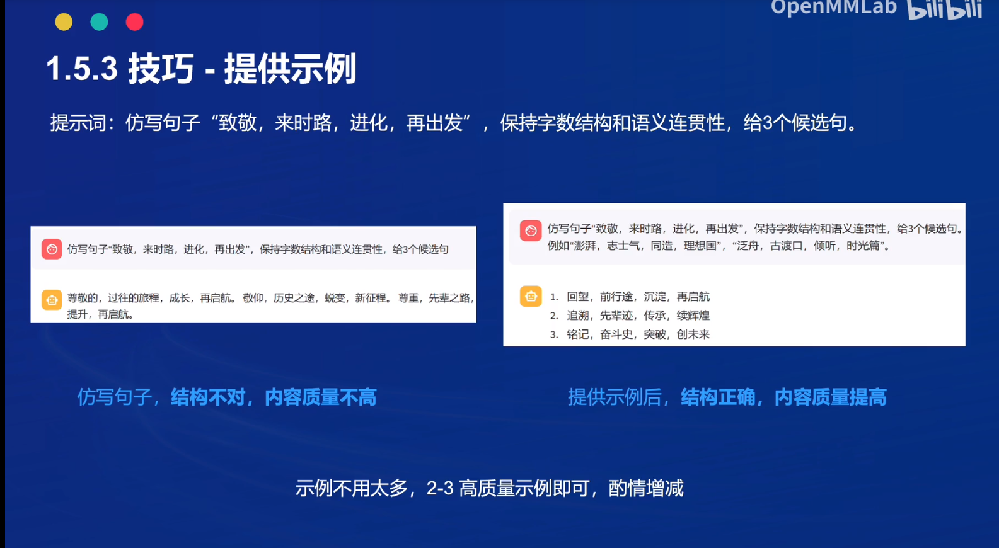
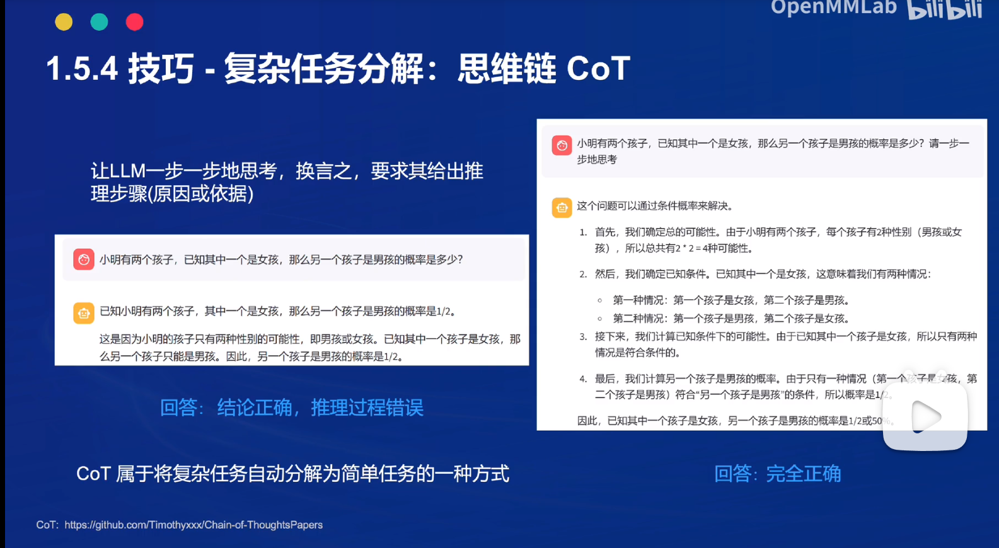

# 提示词工程

## 1.提示词简介
Prompt是一种用于指导以大语言模型为代表的生成式人工智能生成内容(文本、图像、视频等)的输入方式。它通常是一个简短的文本或问题，用于描述任务和要求。

Prompt可以包含一些特定的关键词或短语，用于引导模型生成符合特定主题或风格的内容。例如，如果我们要生成一篇关于“人工智能”的文章，我们可以使用“人工智能”作为Prompt，让模型生成一篇关于人工智能的介绍、应用、发展等方面的文章。

提示工程是模型性能优化的基石，有以下六大基本原则：
1. 指令要清晰
2. 提供参考内容
3. 复杂的任务拆分成子任务
4. 给 LLM“思考”时间(给出过程)
5. 使用外部工具
6. 系统性测试变化

## 2.提示词工程的技巧
1. 提供示例
    
2. 将任务拆解成思维连
    

## 3.例子：草莓数“r”
通过将问题拆分成子问题一步一步引导能使得回答结果更加精确可靠
