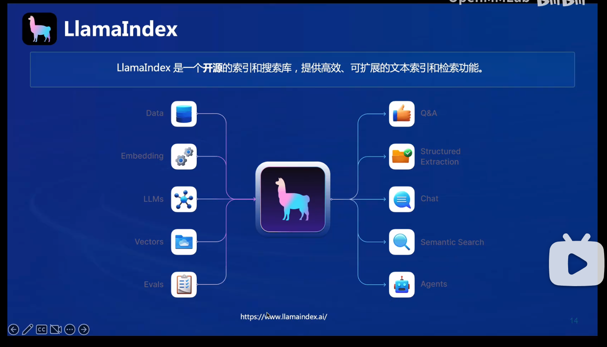
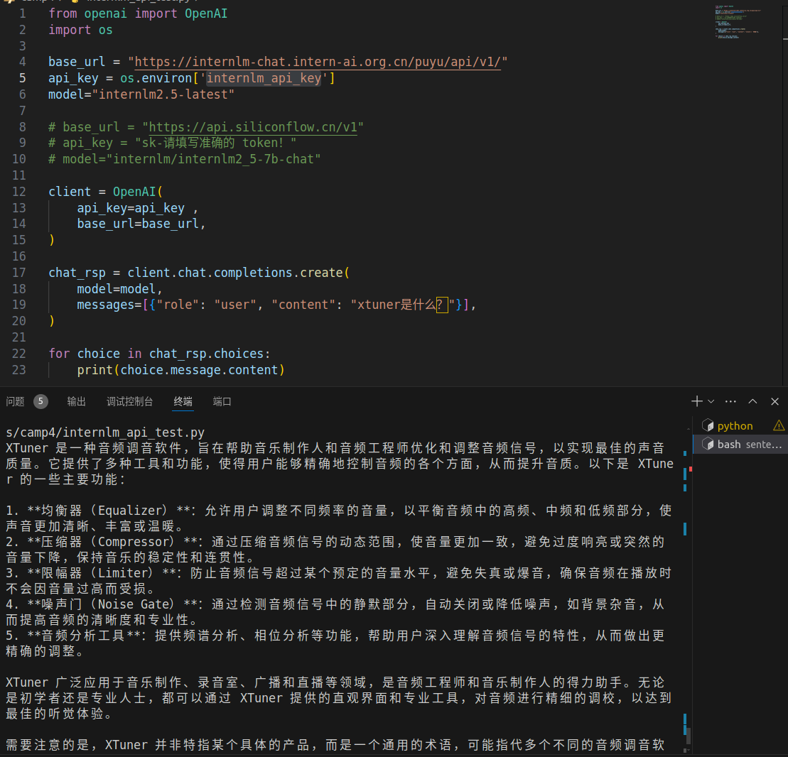
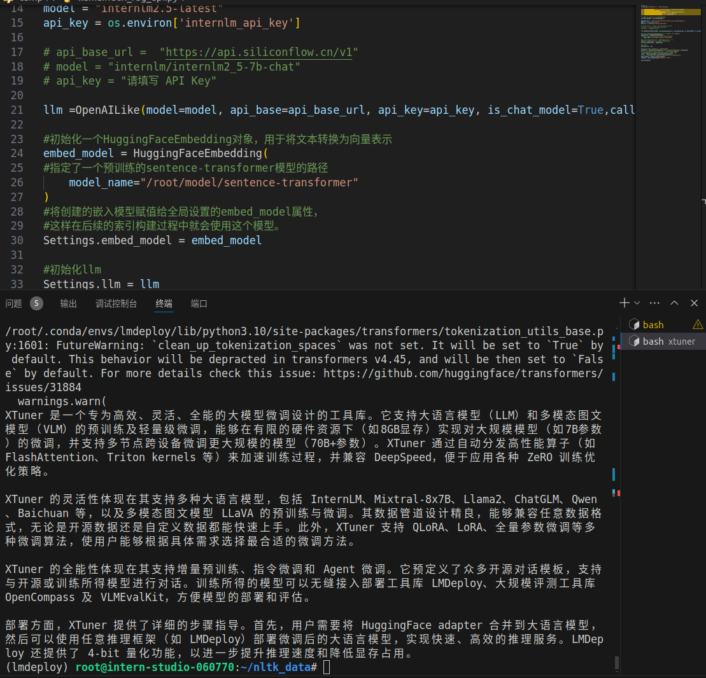
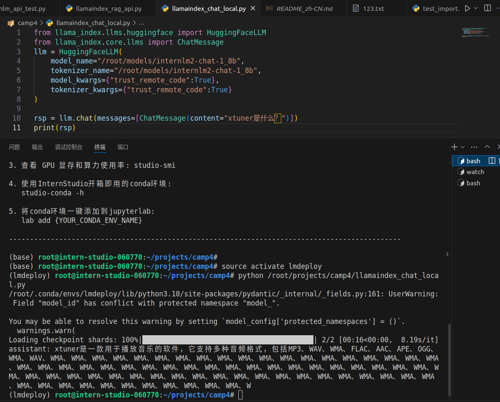
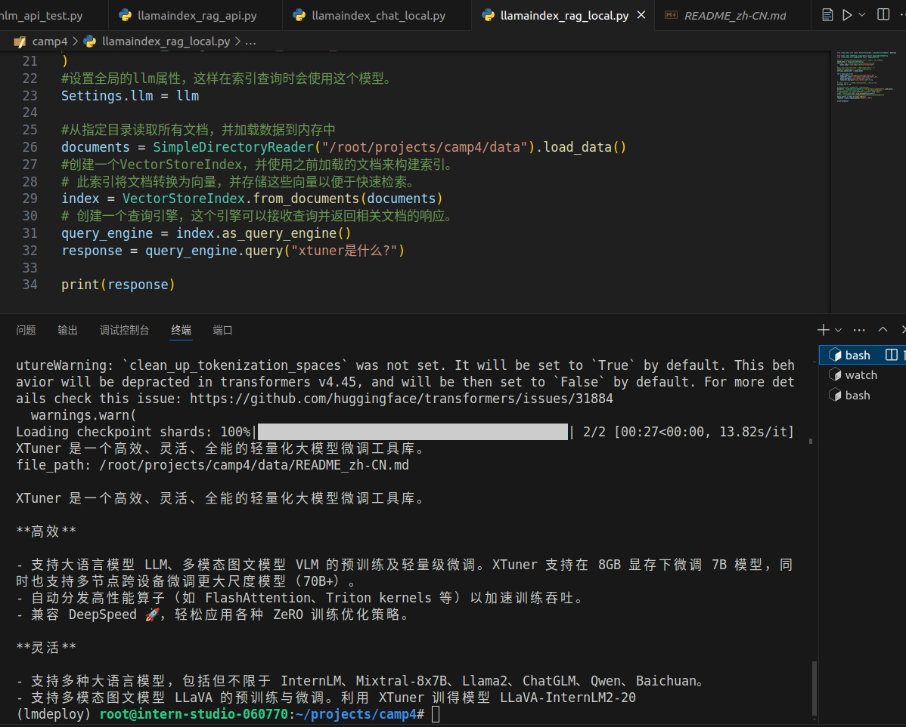

# LlamaIndex+InternLM RAG 实践

## 1.RAG简介
RAG 能够让基础模型实现非参数知识更新，无需训练就可以掌握新领域的知识。它允许您构建应用程序，既利用 LLMs 的优势，又融入您的私有或领域特定信息。

LlamaIndex框架可以方便的构建RAG系统，其主要功能如下图


## 2.RAG调用大模型api
RAG使用大模型api可以减少本机的资源占用，同时提高运行速度与执行效率。
以询问xtuner是什么为例，当没有使用相关RAG数据库，生成的调音软件这个答案

当外挂RAG数据库我们获得我们想要的回答


代码如下：
```
	
	from llama_index.core import VectorStoreIndex, SimpleDirectoryReader, Settings
	
	from llama_index.embeddings.huggingface import HuggingFaceEmbedding
	from llama_index.llms.huggingface import HuggingFaceLLM
	
	#初始化一个HuggingFaceEmbedding对象，用于将文本转换为向量表示
	embed_model = HuggingFaceEmbedding(
	#指定了一个预训练的sentence-transformer模型的路径
	    model_name="/root/model/sentence-transformer"
	)
	#将创建的嵌入模型赋值给全局设置的embed_model属性，
	#这样在后续的索引构建过程中就会使用这个模型。
	Settings.embed_model = embed_model
	
	llm = HuggingFaceLLM(
	    model_name="/root/model/internlm2-chat-1_8b",
	    tokenizer_name="/root/model/internlm2-chat-1_8b",
	    model_kwargs={"trust_remote_code":True},
	    tokenizer_kwargs={"trust_remote_code":True}
	)
	#设置全局的llm属性，这样在索引查询时会使用这个模型。
	Settings.llm = llm
	
	#从指定目录读取所有文档，并加载数据到内存中
	documents = SimpleDirectoryReader("/root/llamaindex_demo/data").load_data()
	#创建一个VectorStoreIndex，并使用之前加载的文档来构建索引。
	# 此索引将文档转换为向量，并存储这些向量以便于快速检索。
	index = VectorStoreIndex.from_documents(documents)
	# 创建一个查询引擎，这个引擎可以接收查询并返回相关文档的响应。
	query_engine = index.as_query_engine()
	response = query_engine.query("xtuner是什么?")
	
	print(response)
	
```

## 3.RAG调用本地大模型
与api调用方式类似，本地启动大模型也可以看到使用RAG后模型效果的提升，本地模型我们用InternLM1.8B为例8G现存即可启动

当外挂RAG数据库我们获得我们想要的回答

代码如下：
```
import streamlit as st
from llama_index.core import VectorStoreIndex, SimpleDirectoryReader, Settings
from llama_index.embeddings.huggingface import HuggingFaceEmbedding
from llama_index.legacy.callbacks import CallbackManager
from llama_index.llms.openai_like import OpenAILike

# Create an instance of CallbackManager
callback_manager = CallbackManager()

api_base_url =  "https://internlm-chat.intern-ai.org.cn/puyu/api/v1/"
model = "internlm2.5-latest"
api_key = "请填写 API Key"

# api_base_url =  "https://api.siliconflow.cn/v1"
# model = "internlm/internlm2_5-7b-chat"
# api_key = "请填写 API Key"

llm =OpenAILike(model=model, api_base=api_base_url, api_key=api_key, is_chat_model=True,callback_manager=callback_manager)


st.set_page_config(page_title="llama_index_demo", page_icon="🦜🔗")
st.title("llama_index_demo")

# 初始化模型
@st.cache_resource
def init_models():
    embed_model = HuggingFaceEmbedding(
        model_name="/root/model/sentence-transformer"
    )
    Settings.embed_model = embed_model

    #用初始化llm
    Settings.llm = llm

    documents = SimpleDirectoryReader("/root/llamaindex_demo/data").load_data()
    index = VectorStoreIndex.from_documents(documents)
    query_engine = index.as_query_engine()

    return query_engine

# 检查是否需要初始化模型
if 'query_engine' not in st.session_state:
    st.session_state['query_engine'] = init_models()

def greet2(question):
    response = st.session_state['query_engine'].query(question)
    return response

      
# Store LLM generated responses
if "messages" not in st.session_state.keys():
    st.session_state.messages = [{"role": "assistant", "content": "你好，我是你的助手，有什么我可以帮助你的吗？"}]    

    # Display or clear chat messages
for message in st.session_state.messages:
    with st.chat_message(message["role"]):
        st.write(message["content"])

def clear_chat_history():
    st.session_state.messages = [{"role": "assistant", "content": "你好，我是你的助手，有什么我可以帮助你的吗？"}]

st.sidebar.button('Clear Chat History', on_click=clear_chat_history)

# Function for generating LLaMA2 response
def generate_llama_index_response(prompt_input):
    return greet2(prompt_input)

# User-provided prompt
if prompt := st.chat_input():
    st.session_state.messages.append({"role": "user", "content": prompt})
    with st.chat_message("user"):
        st.write(prompt)

# Gegenerate_llama_index_response last message is not from assistant
if st.session_state.messages[-1]["role"] != "assistant":
    with st.chat_message("assistant"):
        with st.spinner("Thinking..."):
            response = generate_llama_index_response(prompt)
            placeholder = st.empty()
            placeholder.markdown(response)
    message = {"role": "assistant", "content": response}
    st.session_state.messages.append(message)
```