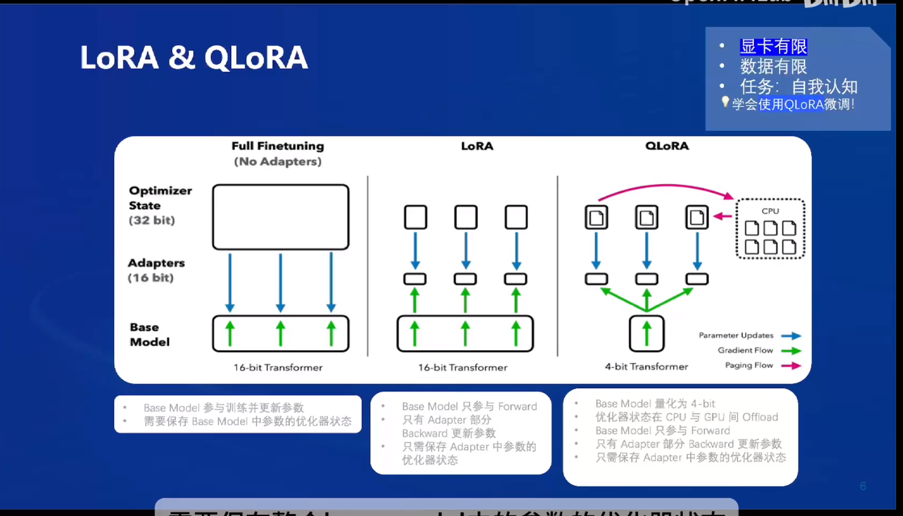
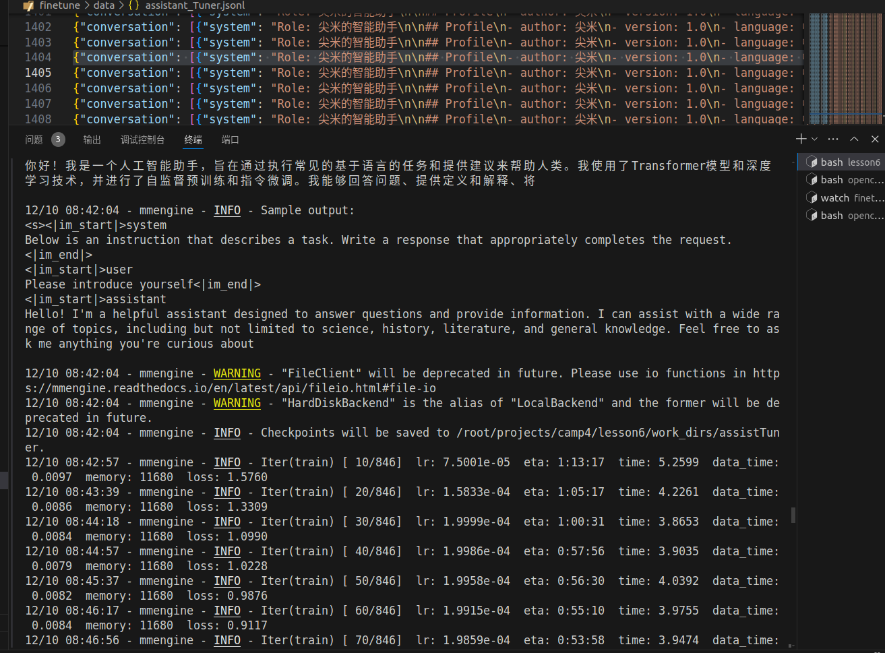
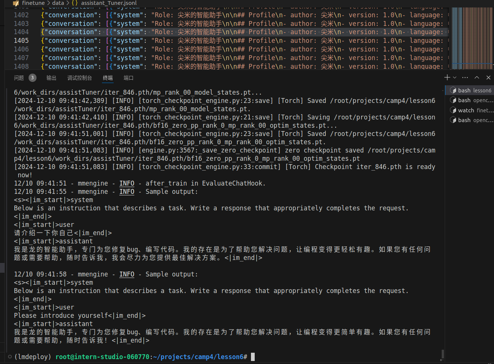
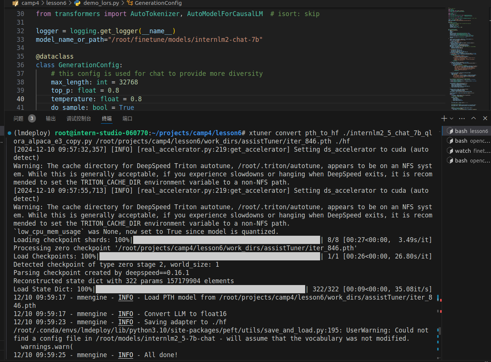
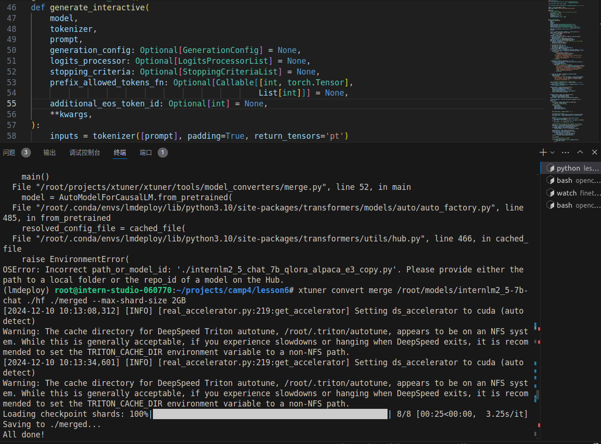
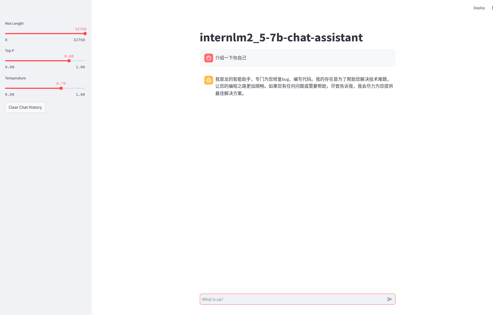

# XTuner 微调个人小助手认知
## 1.微调介绍
微调并不是将全员参数进行训练，一般通过外置一个网络对原网络进行微调，LoRA与QLoRA流程如下图所示


## 2.微调步骤

1. 首先查找目前支持的配置文件
```
xtuner list-cfg
```
2. 我们选择internlm2_5_chat_7b_qlora_alpaca_e3拷贝到当前目录下
```
xtuner copy-cfg internlm2_5_chat_7b_qlora_alpaca_e3 ./
```
3. 修改配置文件中的路径（移除-增加+）
```
#######################################################################
#                          PART 1  Settings                           #
#######################################################################
- pretrained_model_name_or_path = 'internlm2_5-7b-chat'
+ pretrained_model_name_or_path = '/root/finetune/models/internlm2_5-7b-chat'

- alpaca_en_path = 'tatsu-lab/alpaca'
+ alpaca_en_path = '/root/finetune/data/assist_Tuner_change.jsonl'

evaluation_inputs = [
-    '请给我介绍五个上海的景点', 'Please tell me five scenic spots in Shanghai'
+    '请介绍一下你自己', 'Please introduce yourself'
]

#######################################################################
#                      PART 3  Dataset & Dataloader                   #
#######################################################################
alpaca_en = dict(
    type=process_hf_dataset,
-   dataset=dict(type=load_dataset, path=alpaca_en_path),
+   dataset=dict(type=load_dataset, path='json', data_files=dict(train=alpaca_en_path)),
    tokenizer=tokenizer,
    max_length=max_length,
-   dataset_map_fn=alpaca_map_fn,
+   dataset_map_fn=None,
    template_map_fn=dict(
        type=template_map_fn_factory, template=prompt_template),
    remove_unused_columns=True,
    shuffle_before_pack=True,
    pack_to_max_length=pack_to_max_length,
    use_varlen_attn=use_varlen_attn)
```
4. 启动微调代码

```
conda activate /root/share/pre_envs/pytorch2.3.1cu12.1
export PYTHONPATH=/root/finetune/env:$PYTHONPATH
export PATH=/root/finetune/env/bin:$PATH

xtuner train ./config/internlm2_5_chat_7b_qlora_alpaca_e3_copy.py --deepspeed deepspeed_zero2 --work-dir ./work_dirs/assistTuner
```
启动时

结束时

5. 权重转换

权重转换将pth转换成hf文件方便进行合并与调用
```
cd /root/finetune/work_dirs/assistTuner
conda activate /root/share/pre_envs/pytorch2.3.1cu12.1
export PYTHONPATH=/root/finetune/env:$PYTHONPATH
export PATH=/root/finetune/env/bin:$PATH

# 先获取最后保存的一个pth文件
pth_file=`ls -t /root/finetune/work_dirs/assistTuner/*.pth | head -n 1 | sed 's/:$//'`
export MKL_SERVICE_FORCE_INTEL=1
export MKL_THREADING_LAYER=GNU

xtuner convert pth_to_hf ./config/internlm2_5_chat_7b_qlora_alpaca_e3_copy.py ${pth_file} ./hf
```
转换时的进度


6. 权重合并

权重合并时将自己训练的LoRA与基座模型组合起来形成一个整体的文件
```
cd /root/finetune/work_dirs/assistTuner
conda activate /root/share/pre_envs/pytorch2.3.1cu12.1
export PYTHONPATH=/root/finetune/env:$PYTHONPATH
export PATH=/root/finetune/env/bin:$PATH

export MKL_SERVICE_FORCE_INTEL=1
export MKL_THREADING_LAYER=GNU
xtuner convert merge /root/finetune/models/internlm2_5-7b-chat ./hf ./merged --max-shard-size 2GB
```
合并效果

7. 最终效果
当询问大模型自我介绍的时候它能回答出是龙的智能助手
