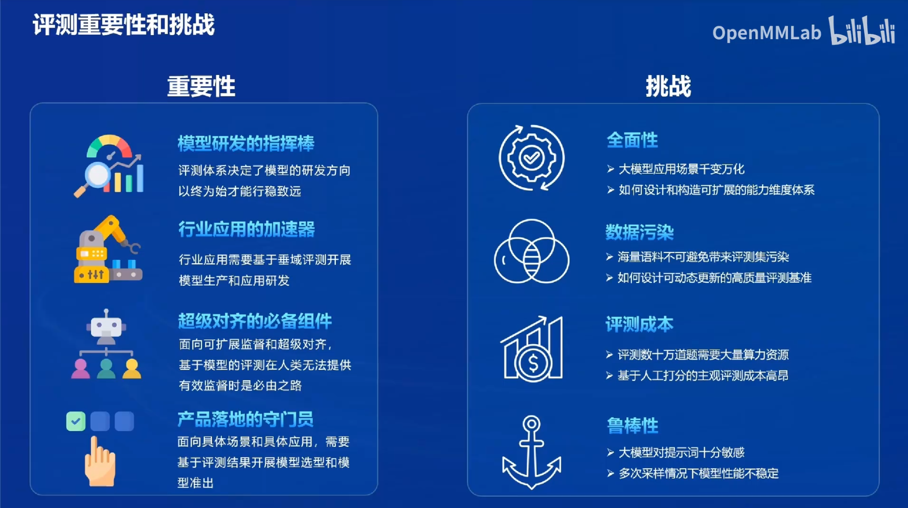
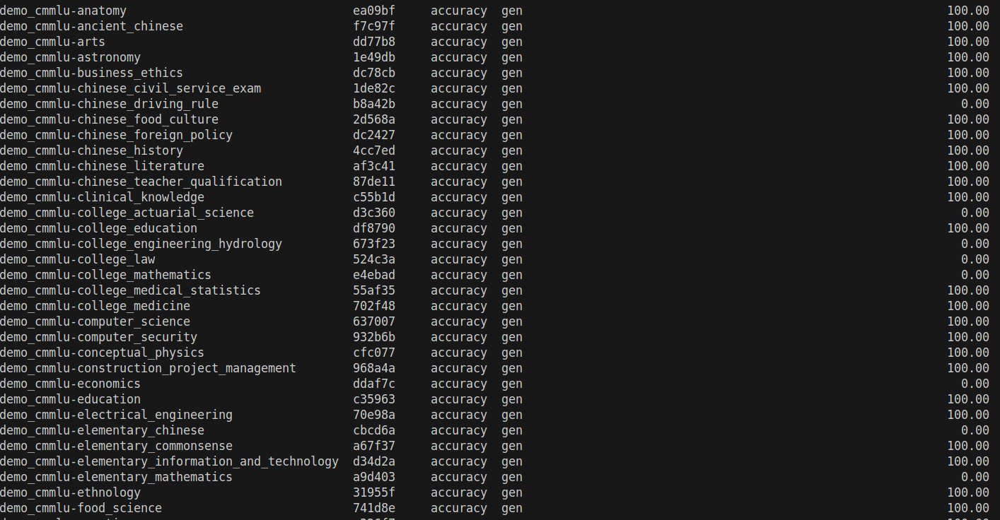
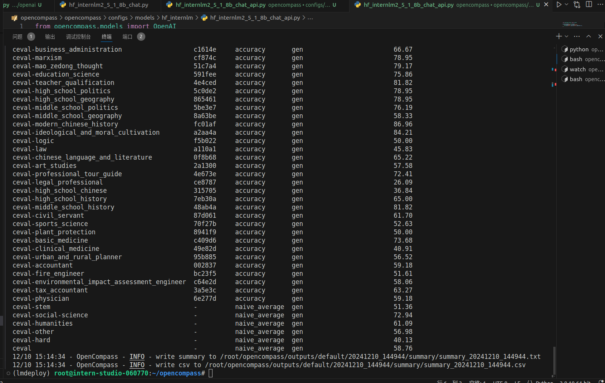
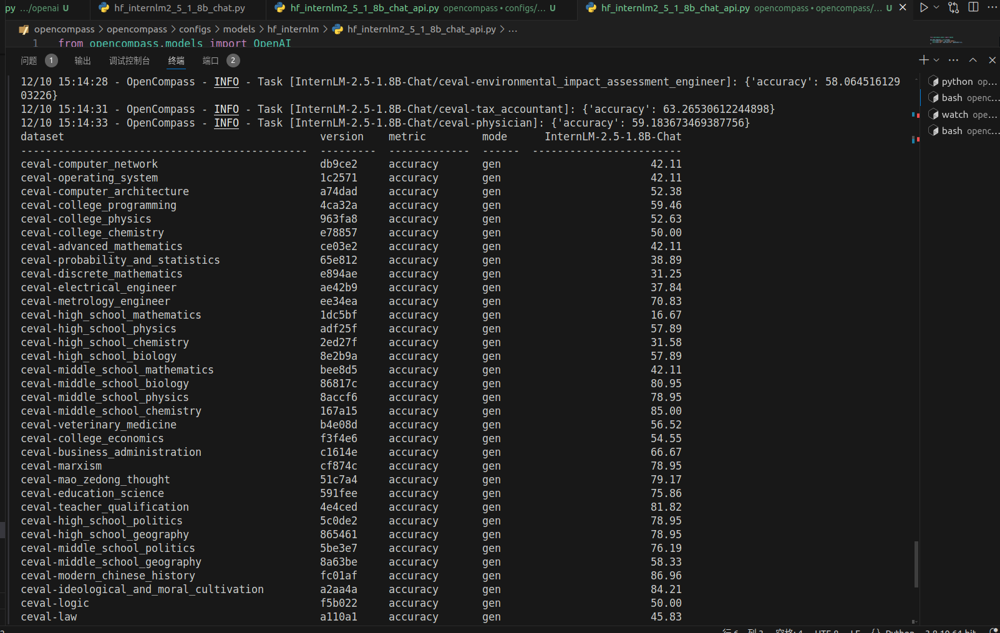

# OpenCompass 评测书生大模型实践

## 1.OpenCompass简介
OpenCompass是一个大模型评测框架,该框架有大量的大模型测评工具以及数据集合等为大模型性能提供了一个较好的量化标准。


## 2.OpenCompass实战

### 2.1对远程大模型进行测评

1. 首先拿到远程大模型的api-key，例如
```
export INTERNLM_API_KEY=xxxxxxxxxxxxxxxxxxxxxxx # 填入你申请的 API Key
```
2. 下载相关依赖
```
conda create -n opencompass python=3.10
conda activate opencompass

cd /root
git clone -b 0.3.3 https://github.com/open-compass/opencompass
cd opencompass
pip install -e .
pip install -r requirements.txt
pip install huggingface_hub==0.25.2

pip install importlib-metadata
```
3. 增加或者修改配置文件`opencompass/configs/models/openai/puyu_api.py`
   
```
import os
from opencompass.models import OpenAISDK


internlm_url = 'https://internlm-chat.intern-ai.org.cn/puyu/api/v1/' # 你前面获得的 api 服务地址
internlm_api_key = os.getenv('INTERNLM_API_KEY')

models = [
    dict(
        # abbr='internlm2.5-latest',
        type=OpenAISDK,
        path='internlm2.5-latest', # 请求服务时的 model name
        # 换成自己申请的APIkey
        key=internlm_api_key, # API key
        openai_api_base=internlm_url, # 服务地址
        rpm_verbose=True, # 是否打印请求速率
        query_per_second=0.16, # 服务请求速率
        max_out_len=1024, # 最大输出长度
        max_seq_len=4096, # 最大输入长度
        temperature=0.01, # 生成温度
        batch_size=1, # 批处理大小
        retry=3, # 重试次数
    )
]
```
3. 运行测评
```
python run.py --models puyu_api.py --datasets demo_cmmlu_chat_gen.py --debug
```

**最终结果如下图**


### 2.1对本地大模型进行测评
1. 首先用lmdeploy启动本地大模型生成api
```
pip install lmdeploy==0.6.1 openai==1.52.0

lmdeploy serve api_server /share/new_models/Shanghai_AI_Laboratory/internlm2_5-1_8b-chat/ --server-port 23333
```
2. 修改配置文件
```
from opencompass.models import OpenAI

api_meta_template = dict(round=[
    dict(role='HUMAN', api_role='HUMAN'),
    dict(role='BOT', api_role='BOT', generate=True),
])

models = [
    dict(
        abbr='InternLM-2.5-1.8B-Chat',
        type=OpenAI,
        path='/share/new_models/Shanghai_AI_Laboratory/internlm2_5-1_8b-chat/', # 注册的模型名称
        key='sk-123456',
        openai_api_base='http://0.0.0.0:23333/v1/chat/completions', 
        meta_template=api_meta_template,
        query_per_second=1,
        max_out_len=2048,
        max_seq_len=4096,
        batch_size=8),
]
```
3. 运行程序
```
opencompass --models hf_internlm2_5_1_8b_chat_api --datasets ceval_gen --debug # opencompass 命令基本等价于 python run.py 命令
```

**最终结果如下图**

