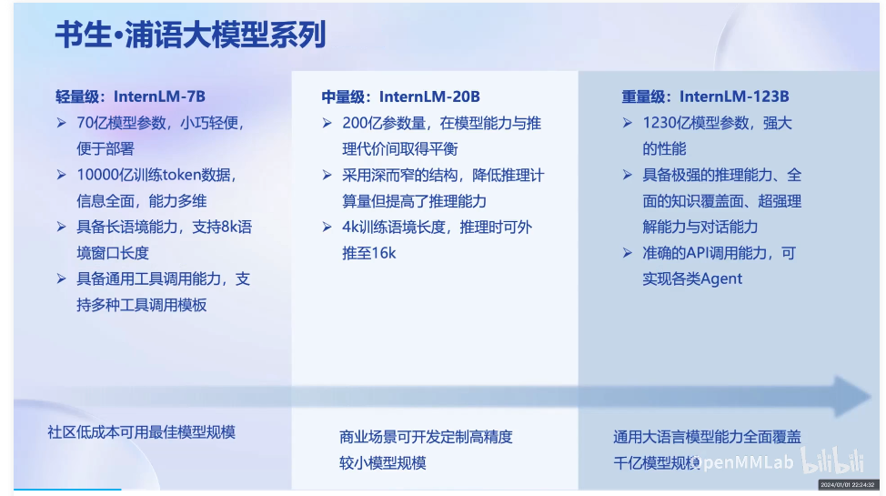
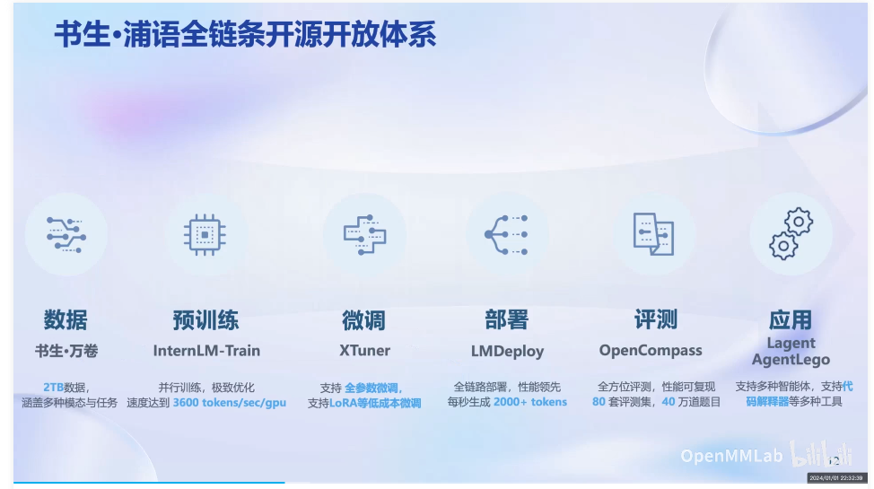
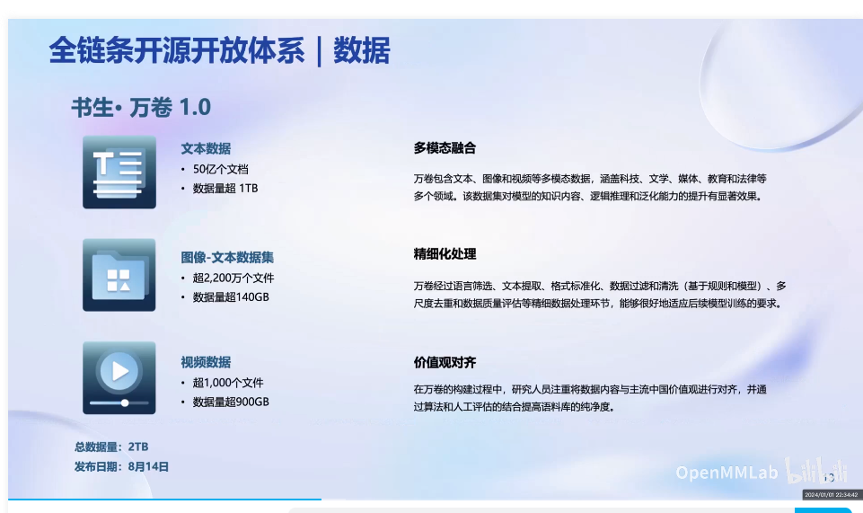

# 书生·浦语大模型全链路开源体系

## 1. 背景介绍
书生·浦语大模型包含了7B、20B等诸多预训练模型，以及相应的模型微调、模型评估、模型推理等模块。

## 2. 框架分类
* 基础模型框架InternLM
* 微调模型框架XTuner
* 部署模型框架LMDeploy
* 评测模型框架OpenCompass
* 应用集成Langent

## 3. 数据集
同时包含大量对齐过的文字、图片、音频、视频等数据集，为用户构建自己的数据集提供方便。
