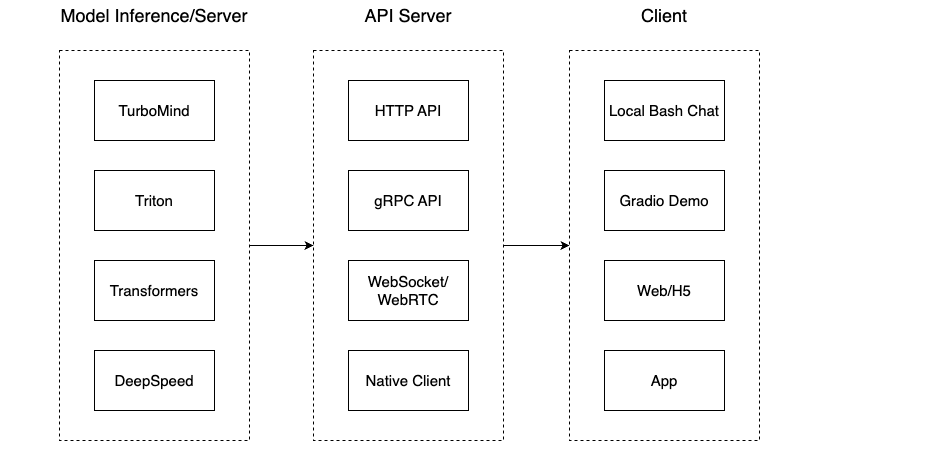

# LMdeploy

## 1. 什么是LMdeploy
LMdeploy 有两个功能：量化与部署。量化加快推理速度减少现存占用，部署可以用客户端、网页以及Api迅速调用方便开发者使用。


## 2. LMdeploy量化使用
模型转化：
HuggingFace模型->Turbomind模型->KV Cashe量化->w4a16量化

### 2.1 turbomind模型转化
以internlm-chat-7b转化为例
```
lmdeploy convert internlm-chat-7b  /root/share/temp/model_repos/internlm-chat-7b/
```

### 2.2 kv cache量化
数据对齐
```
# 计算 minmax
lmdeploy lite calibrate \
  --model  /root/share/temp/model_repos/internlm-chat-7b/ \
  --calib_dataset "c4" \
  --calib_samples 128 \
  --calib_seqlen 2048 \
  --work_dir ./quant_output
```
量化权重文件

```
# 通过 minmax 获取量化参数
lmdeploy lite kv_qparams \
  --work_dir ./quant_output  \
  --turbomind_dir workspace/triton_models/weights/ \
  --kv_sym False \
  --num_tp 1
```

### 2.3 w4a16量化

## 3.LMdeploy部署使用
### 3.1 terminal:
```
# Turbomind + Bash Local Chat
lmdeploy chat turbomind ./workspace
```

### 3.2 API
```
# ApiServer+Turbomind   api_server => AsyncEngine => TurboMind
lmdeploy serve api_server ./workspace \
	--server_name 0.0.0.0 \
	--server_port 23333 \
	--instance_num 64 \
	--tp 1
```
### 3.3 Gradio
```
# Gradio+Turbomind(local)
lmdeploy serve gradio ./workspace
```
