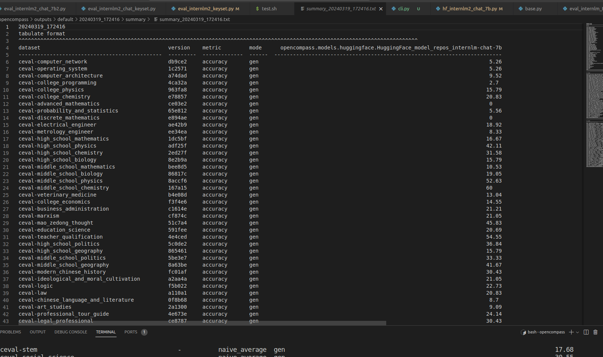

# 基础作业
测试inteernlm2-chat-7b 在ceval上的性能

```python
python run.py --datasets ceval_gen --hf-path /share/temp/model_repos/internlm2-chat-7b/ --tokenizer-path /share/temp/model_repos/internlm2-chat-7b/ --tokenizer-kwargs padding_side='left' truncation='left' trust_remote_code=True --model-kwargs trust_remote_code=True device_map='auto' --max-seq-len 2048 --max-out-len 16 --batch-size 4 --num-gpus 1 --debug
```

## 有--debug


## 没有--debug
