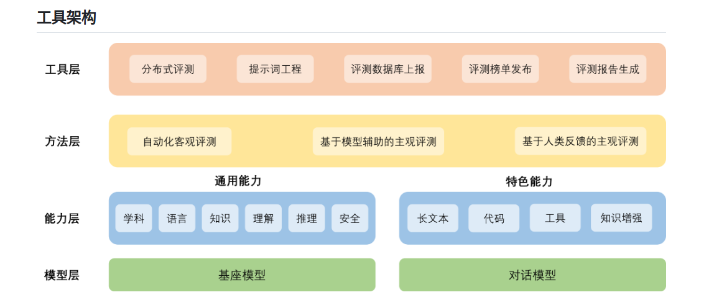

# OpenCompass
## 1. 项目介绍
OpenCompass是一个开源的开源评测框架，可以进行主观与客观评测。客观评测可以根据答案匹配度判断分数，因此较为简单，客观评价可以快速进行。主观评价可以使用人工评分，也可以使用机器学习评分，当有先进模型A时可以使用A模型给B模型打分，如果没有先进的模型也可以用竞争的方式打分，比如用A模型同时对BC打分，用相对准确度替代绝对准确度。


## 2.使用
### 1.命令行形式
对internlm-chat-7b在ceval 数据集上打分
```python
--datasets ceval_gen \
--hf-path /share/temp/model_repos/internlm-chat-7b/ \  # HuggingFace 模型路径
--tokenizer-path /share/temp/model_repos/internlm-chat-7b/ \  # HuggingFace tokenizer 路径（如果与模型路径相同，可以省略）
--tokenizer-kwargs padding_side='left' truncation='left' trust_remote_code=True \  # 构建 tokenizer 的参数
--model-kwargs device_map='auto' trust_remote_code=True \  # 构建模型的参数
--max-seq-len 2048 \  # 模型可以接受的最大序列长度
--max-out-len 16 \  # 生成的最大 token 数
--batch-size 2  \  # 批量大小
--num-gpus 1  # 运行模型所需的 GPU 数量
--debug
```
### 2.python形式

对opt125m, opt350m两个模型在siqa_datasets, winograd_datasets两个数据   集上进行评测。

```python
from mmengine.config import read_base

with read_base():
    from .datasets.siqa.siqa_gen import siqa_datasets
    from .datasets.winograd.winograd_ppl import winograd_datasets
    from .models.opt.hf_opt_125m import opt125m
    from .models.opt.hf_opt_350m import opt350m

datasets = [*siqa_datasets, *winograd_datasets]
models = [opt125m, opt350m]
```